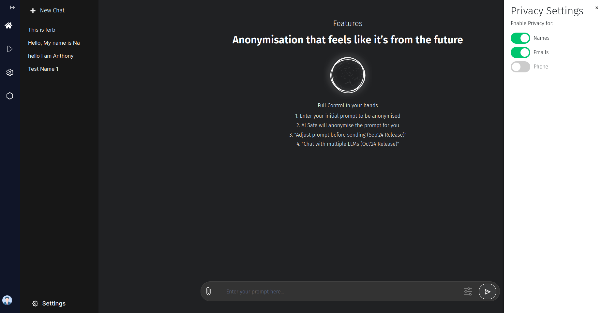

# AI-Safe Technology 🛡️

**AI-Safe** ensures your sensitive data stays private while using **Privacy AI**.

### Key Features:
- 🔒 **Anonymization**: All personal data like names, emails, and phone numbers are anonymized before the data is sent to the backend.
- 🔄 **Data Restoration**: Once processed, the data is returned in its original format without compromising privacy.
- ⚙️ **Custom Filters**: You can control what elements (e.g., names, emails, phone numbers) should be anonymized, giving you full control over your privacy settings.

[Explore Data History and Security ➡️](./history-and-security.md)  
