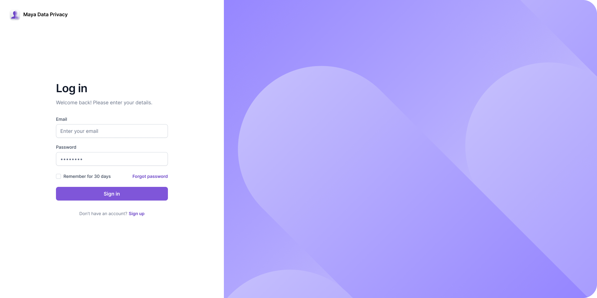

# Account Setup & Management  
**Your Complete Guide to Registration, Login, and Password Reset**

Welcome to the **User Guide** for account setup! Whether you're new to the platform or just need a quick refresher, this guide will walk you through the essential steps for **registering**, **logging in**, and **resetting your password**. Let's make your experience smooth and hassle-free from the start!

---

## 📋 Step 1: How to Register?  

Creating your account is the first step to unlocking everything the platform has to offer. Follow these steps to get started:

1. **Fill out the registration form** with all required details. Every field is mandatory, so take your time to ensure all information is correct—especially your email address. This will be used for logging in and password resets, so double-check its accuracy.
   
2. **Password Requirements**:  
   Your password needs to meet the following criteria to ensure the security of your account:
   - At least **8 characters** in length
   - Includes both **uppercase** and **lowercase letters**
   - Contains **at least one number** and **one special character** (like `!`, `@`, `#`, etc.)

3. **Review Terms & Privacy Policies**:  
   Before you finalize your registration, carefully read through the [Terms of Use](#) and [Privacy Policy](#). These outline your rights and responsibilities on the platform. If you agree to the terms, click the **‘Sign up’** button. **By clicking**, you confirm your agreement and initiate the registration process.

4. After registering, you’ll be automatically redirected to the **Login** page, ready for your first sign-in!

---

## 🔑 Step 2: How to Login?  

Now that you're registered, logging in is a breeze. Here’s how:

1. Go to the **Login page** and enter your registered email and password.
   
2. **Prove You’re Human**:  
   For security purposes, you’ll be asked to complete a **reCAPTCHA** to verify you're not a robot.

3. Click the **‘Sign in’** button. If your details are correct, you'll be taken directly to your personal **Dashboard**, where you can explore all the platform features.

<!--  -->

---

## 🔐 Step 3: How to Reset Your Password?  

Forgot your password? No worries! You can easily reset it in just a few clicks:

1. On the **Login page**, click **‘Forgot Password’**, or go directly to the [Password Reset](https://app.mayadataprivacy.eu/forgotPassword) page.

2. In the **Password Reset Form**, provide the email address you used during registration, then click **‘Reset’**.

3. If the details match, you’ll see a confirmation message: **‘Password reset successful’**. An email containing the next steps will be sent to you. If it’s not in your inbox, check your spam or junk folder.

---

## 🍪 Step 4: Cookie Acceptance 

After successful login, a popup will appear asking you to accept cookies.

1. If you click **‘Accept’**, you will be redirected to your **Dashboard**.
2. If you decline, you will be logged out automatically for security reasons.  

--- 

## ✨ Enjoy Your Platform Experience!  

With this guide, you’re all set to register, log in, or recover your password with ease. Should you run into any issues, our support team is just a message away, ready to assist.  

Happy exploring! 🌟