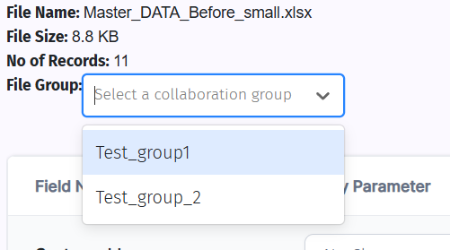
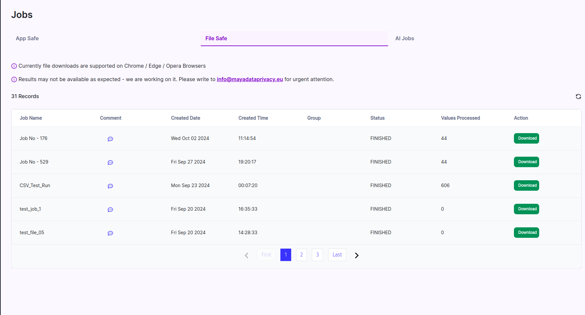

# 🔒 Comprehensive Guide to File Anonymization  

Welcome to the professional documentation for securely anonymizing sensitive data using our platform. This guide will walk you through the entire process, from file upload to applying anonymization configurations and saving your anonymized files.

---

## Step 1: Select New FileSafe Run

To begin, select a new FileSafe run from the sidebar. This will initiate the anonymization process.

---

## 📤 Step 2: Upload Your File

Upload your data file in **.xlsx** or **.csv** format by following these steps:

1. **Click** the **‘Choose a file’** button.
2. **Select** your file from your device.
3. You can use one of the available **sample files** to explore the process.

📝 **Note**: The first row of your file will be treated as the **header**, and the platform will use it as field names for the anonymization process. Ensure your headers are accurate.

---

## Step 3: Select Collaboration Group or Create a New One

Collaboration groups help maintain consistency across different datasets. Select an existing group or create a new one to ensure uniform application of anonymization rules across projects.

---

## 🛠️ Step 4: Configure Utility Parameters and Conditions

After uploading your file, it’s time to configure **utility parameters** and their corresponding **conditions** for each data field.

### Utility Parameters and Conditions Table

| **Utility Parameter**  | **Conditions**                             | **Description**                                                                |
| ---------------------- | ------------------------------------------ | ------------------------------------------------------------------------------ |
| **No Change**          | N/A                                        | Leaves the data unchanged.                                                     |
| **Clear Values**       | N/A                                        | Clears or wipes out the data in the selected fields.                           |
| **Email**              | Dummy Domain, Keep Domain, All Caps        | Anonymizes email addresses with additional formatting options.                 |
| **Name**               | First Name, Last Name, All Caps, Full Name | Handles name fields with specific conditions for first name, last name, etc.   |
| **Consistent ID**      | N/A                                        | Generates a consistent identifier for tracking across records.                 |
| **Fixed Value**        | N/A                                        | Replaces the field with a fixed value.                                         |
| **Date**               | Same Year, Random, Adult, Consistent       | Anonymizes date fields while retaining some options for consistency.           |
| **Phone Number**       | N/A                                        | Handles phone numbers by formatting them or generating new numbers.            |
| **Number**             | N/A                                        | Randomizes or anonymizes numerical data.                                       |
| **Custom Expressions** | N/A                                        | Allows custom regular expressions or formats to be applied to the data fields. |

---

### Condition-Specific Details:

1. **Email Conditions**:
   - **Dummy Domain**: Replaces the email domain (e.g., `example.com`).
   - **Keep Domain**: Retains the original domain while anonymizing the rest of the email.
   - **All Caps**: Converts the entire email to uppercase.

2. **Name Conditions**:
   - **First Name**: Anonymizes only the first name field.
   - **Last Name**: Anonymizes only the last name field.
   - **All Caps**: Converts the name to uppercase.
   - **Full Name**: Anonymizes the entire full name as a single unit.

3. **Date Conditions**:
   - **Same Year**: Keeps the year consistent across all records.
   - **Random**: Randomizes the entire date.
   - **Adult**: Ensures the date reflects an adult age.
   - **Consistent**: Keeps the date consistent across records.

---

## 💾 Step 5: Save the Anonymized File

Once the utility parameters and conditions have been set, proceed to save the anonymized version of your file:

1. **Select** the **file group**, **utility set**, and confirm the parameters.
2. Click the **‘Execute’** button.
3. A pop-up will appear. **Enter the desired file name**.
4. Click **‘Submit’** to start the anonymization process.

🚀 **Post-Submission**: After submission, you’ll be redirected to the **History page** where you can track the status of your job.

---

## 🔄 Step 6: Monitor Job Status

Navigate to the **History page** to check the progress of your anonymization job:

1. Use the **‘Refresh’ button** in the top-right corner.
2. The status will update (e.g., **‘In Progress’**, **‘Completed’**).

---

## PII Type Derivation

You can easily identify **PII (Personal Identifiable Information)** types by clicking on the respective button. This will categorize the fields that contain sensitive information, helping you apply the right anonymization rules.

---

## 🎯 Conclusion

By following these steps, you can securely anonymize your data with ease. If you encounter any difficulties, our support team is always available to assist.

